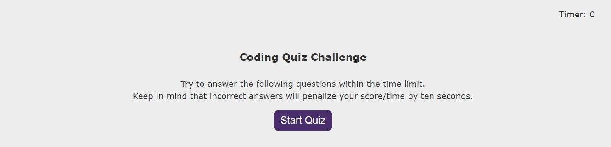

# Quiz

This website is a timed quiz on JavaScript fundamentals with multiple-choice questions. 
Every wrong answer is penalized by time/score: time gets descreased by 10sec.
The final score is stored in the Local Storage.

# Deployed web site

The link to deployed site is https://evkonradi.github.io/quiz/.

# GitHub repository

You can find the repository here: https://github.com/evkonradi/quiz.

# Page preview

This is the preview of the initial page of the quiz:
